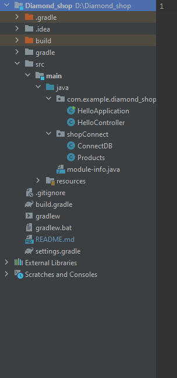
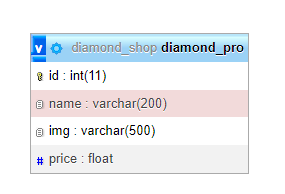

1. Cấu trúc dự án:

2. Entity Relationship Model, em chỉ mới tạo một bảng cho nên không có mối quan hệ nào cả.

- Đây là một vài dữ liệu mà em đã tạo

3. Video demo của em:
   https://drive.google.com/drive/folders/1CFeFFPfr5jhfp9vw1Zb1bLINTafHG-IS?usp=sharing
4. Các chức năng mà em đã làm được đó là: 
- Hiển thị
- Thêm
- Sửa 
- Xóa
5. Các chức năng dự định sẽ làm nếu đủ thời gian và nếu làm được đó là:
- Chức năng log in
- Bill sau khi ấn đặt mua
- Giỏ hàng
6. Giao diện sau khi chạy:

=======

